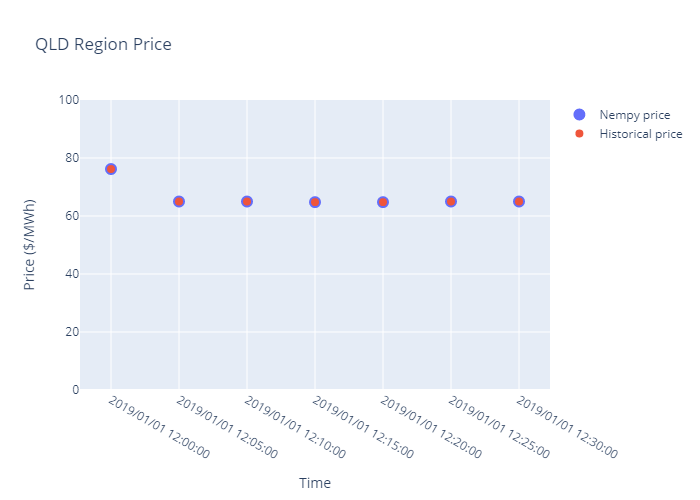

.. _examples1:

Examples
====================
A number of examples of how to use Nempy are provided below. Examples 1 to 5 are simple and aim introduce various
market features that can be modelled with Nempy in an easy to understand way, the dispatch and pricing outcomes are
explained in inline comments where the results are printed. Examples 6 and 7 show how to use the historical data input
preparation tools provided with Nempy to recreate historical dispatch intervals. Historical dispatch and pricing
outcomes can be difficult to interpret as they are usually the result of complex interactions between the many features
of the dispatch process, for these example the results are plotted in comparison to historical price outcomes.
Example 8 demonstrates how the outputs of one dispatch interval can be used as the initial conditions of the
next dispatch interval to create a time sequential model, additionally the current limitations with the approach are
briefly discussed.

1. Bid stack equivalent market
---------------------------
This example implements a one region bid stack model of an electricity market. Under the bid stack model, generators are
dispatched according to their bid prices, from cheapest to most expensive, until all demand is satisfied. No loss factors,
ramping constraints or other factors are considered.

.. literalinclude:: ../../examples/bidstack.py
    :linenos:
    :language: python

2. Unit loss factors, capacities and ramp rates
-----------------------------------------------
A simple example with two units in a one region market, units are given loss factors, capacity values and ramp rates.
The effects of loss factors on dispatch and market prices are explained.

.. literalinclude:: ../../examples/ramp_rates_and_loss_factors.py
    :linenos:
    :language: python

3. Interconnector with losses
-----------------------------
A simple example demonstrating how to implement a two region market with an interconnector. The interconnector is
modelled simply, with a fixed percentage of losses. To make the interconnector flow and loss calculation easy to
understand a single unit is modelled in the NSW region, NSW demand is set zero, and VIC region demand is set to 90 MW,
thus all the power to meet VIC demand must flow across the interconnetcor.

.. literalinclude:: ../../examples/interconnector_constant_loss_percentage.py
    :linenos:
    :language: python

4. Dynamic non-linear interconnector losses
----------------------------------------
This example demonstrates how to model regional demand dependant interconnector loss functions as decribed in the AEMO
:download:`Marginal Loss Factors documentation section 3 to 5  <../../docs/pdfs/Marginal Loss Factors for the 2020-21 Financial year.pdf>`.
To make the interconnector flow and loss calculation easy to understand a single unit is modelled in the NSW region,
NSW demand is set zero, and VIC region demand is set to 800 MW, thus all the power to meet VIC demand must flow across
the interconnetcor.

.. literalinclude:: ../../examples/interconnector_dynamic_losses.py
    :linenos:
    :language: python

5. Simple FCAS markets
----------------------------------------
This example implements a market for energy, regulation raise and contingency 6 sec raise, with
co-optimisation constraints as described in section 6.2 and 6.3 of
:download:`FCAS Model in NEMDE <../../docs/pdfs/FCAS Model in NEMDE.pdf>`.

.. literalinclude:: ../../examples/simple_FCAS_markets.py
    :linenos:
    :language: python

6. Simple recreation of historical dispatch
----------------------------------------
Demonstrates using Nempy to recreate historical dispatch intervals by implementing a simple energy market with unit bids,
unit maximum capacity constraints and interconnector models, all sourced from historical data published by AEMO.

.. image:: ../../examples/charts/energy_market_only_qld_prices.png
  :width: 600

*Results from example: for the QLD region a reasonable fit between modelled prices and historical prices is obtained.*

.. warning:: Warning this script downloads approximately 8.5 GB of data from AEMO. The download_inputs flag can be set
             to false to stop the script re-downloading data for subsequent runs.

.. note:: This example also requires plotly >= 5.3.1, < 6.0.0 and kaleido == 0.2.1. Run pip install plotly==5.3.1 and pip
          install kaleido==0.2.1

.. literalinclude:: ../../examples/recreating_historical_dispatch.py
    :linenos:
    :language: python

7. Detailed recreation of historical dispatch
------------------------------------------
This example demonstrates using Nempy to recreate historical dispatch intervals by implementing a  energy market using all the
features of the Nempy market model, all inputs sourced from historical data published by AEMO. Note each interval is
dispatched as a standalone simulation and the results from one dispatch interval are not carried over to be the initial
conditions of the next interval, rather the historical initial conditions are always used.

*Results from example: for the QLD region a very close fit between modelled prices and historical prices is obtained.*

.. warning:: Warning this script downloads approximately 8.5 GB of data from AEMO. The download_inputs flag can be set
             to false to stop the script re-downloading data for subsequent runs.

.. note:: This example also requires plotly >= 5.3.1, < 6.0.0 and kaleido == 0.2.1. Run pip install plotly==5.3.1 and pip
          install kaleido==0.2.1

.. literalinclude:: ../../examples/all_features_example.py
    :linenos:
    :language: python

8. Time sequential recreation of historical dispatch
-------------------------------------------------
This example demonstrates using Nempy to recreate historical dispatch in a dynamic or time sequential manner, this means the outputs
of one interval become the initial conditions for the next dispatch interval. Note, currently there is not the infrastructure
in place to include features such as generic constraints in the time sequential model as the rhs values of many constraints
would need to be re-calculated based on the dynamic system state. Similarly, using historical bids in this example is
some what problematic as participants also dynamically change their bids based on market conditions. However, for the sake
of demonstrating how Nempy can be used to create time sequential models, historical bids are used in this example.

.. warning:: Warning this script downloads approximately 8.5 GB of data from AEMO. The download_inputs flag can be set
             to false to stop the script re-downloading data for subsequent runs.

.. note:: This example also requires plotly >= 5.3.1, < 6.0.0 and kaleido == 0.2.1. Run pip install plotly==5.3.1 and pip
          install kaleido==0.2.1

.. literalinclude:: ../../examples/time_sequential.py
    :linenos:
    :language: python

8. Nempy performance on recent data (Jan 2022)
----------------------------------------------
This example demonstrates using Nempy to recreate historical dispatch intervals by implementing a energy market using all the
features of the Nempy market model, all inputs sourced from historical data published by AEMO. A set of 100 random dispatch
intervals from a recent month are dispatched and compared to historical results to see if Nempy is keeping up with any
recent changes to the NEM's dispatch procedure. Comparison is against ROP, the region price prior to any post dispatch
adjustments, scaling, capping etc.

Summary of results:

| Mean price error: -0.255
| Median price error: 0.00
| 5% percentile price: error -0.050
| 95% percentile price: error 1.084

.. warning:: Warning this script downloads approximately 84 GB of data from AEMO. The download_inputs flag can be set
             to false to stop the script re-downloading data for subsequent runs.

.. literalinclude:: ../../examples/recent_performance.py
    :linenos:
    :language: python

8. Nempy performance on older data (Jan 2015)
---------------------------------------------
This example demonstrates using Nempy to recreate historical dispatch intervals by implementing a energy market using all the
features of the Nempy market model, all inputs sourced from historical data published by AEMO. A set of 100 random dispatch
intervals from January 2015 are dispatched and compared to historical results to see how well Nempy performs for
replicating older versions of the NEM's dispatch procedure. Comparison is against ROP, the region price prior to any post
dispatch adjustments, scaling, capping etc.

Summary of results:

| Mean price error: -0.240
| Median price error: 0.000
| 5% percentile price: error 0.000
| 95% percentile price: error 0.051

.. warning:: Warning this script downloads approximately 54 GB of data from AEMO. The download_inputs flag can be set
             to false to stop the script re-downloading data for subsequent runs.

.. literalinclude:: ../../examples/performance_on_older_data.py
    :linenos:
    :language: python

