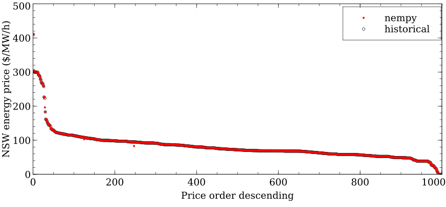
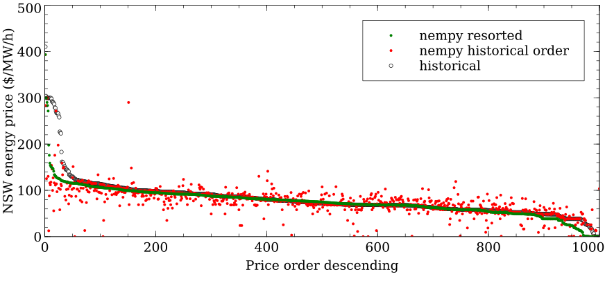

Introduction
============
Nempy is an open-source python package that can be used to model the dispatch procedure of the Australian National
Electricity Market (NEM). The dispatch process is at the core of many market modelling studies. Nempy allows users to
easily configure a dispatch model to fit the relevant research question. Furthermore, if extra functionality is needed,
the python implementation and open-source licencing allow the user to make modifications. Nempy is feature rich,
flexible, can recreate historical dispatch with a high degree of accuracy, runs fast, and has detailed documentation.

The Nempy source code is on GitHub: https://github.com/UNSW-CEEM/nempy.

A brief introduction to the NEM can be found here: https://aemo.com.au/-/media/Files/Electricity/NEM/National-Electricity-Market-Fact-Sheet.pdf

Author
-------
Nempy's development was led by Nick Gorman as part of his PhD candidature at the Collaboration on Energy and Environmental
Markets at the University of New South Wales' School of Photovoltaics and Renewable Energy Engineering. (https://www.ceem.unsw.edu.au/). 

Support
-------
You can seek support for using Nempy using the discussion tab on GitHub (https://github.com/UNSW-CEEM/nempy/discussions), 
checking the issues register (https://github.com/UNSW-CEEM/nempy/issues), or by contacting Nick directly (n.gorman at unsw.edu.au).

Future support and maintenance
-----------------------------
CEEM continues to support and maintain Nempy! If Nempy is useful to your work, research,
or business, please reach out and inform us so we can consider your use case and needs.

Example use cases
-----------------
Nempy is intended for analysts and modellers studying the NEM either in industry or academic. It can be
used either as is, or as building block in a large modelling tool. Some potential use case are:

#. As a tool for studying the dispatch process itself. The example shown in the :ref:`section on model accuracy <Accuracy>`
   below demonstrates how model simplifications effects accuracy, this is potentially useful information for other
   NEM modellers either using Nempy or other modelling tools.
#. As a building block in agent based market models, as part of the environment for agents to interact with.
#. To answer counter factual questions about historical dispatch outcomes. For example, how removing a network
   constraint would have effected dispatch and pricing outcomes?
#. As a reference implementation of the NEM's dispatch procedure. Published documentation can lack detail, studying the
   source code of Nempy may be useful for some NEM analysts to gain a better understanding of the dispatch procedure.

Dispatch Procedure Outline
--------------------------
The main task of the dispatch procedure is the construction and solving of a mixed integer linear problem (MIP) to find the
least cost set of dispatch levels for generators and scheduled loads. Note, in this optimisation the dispatch of
scheduled loads is treated as a negative cost, this makes the least cost optimisation equivalent to maximising the value of
market trade. The construction of the MIP as implemented by Nempy proceeds roughly as follows:

#. Bids from generators and loads are preprocessed, some FCAS bids are excluded if they do not meet a set of inclusion
   criteria set out by AEMO (:download:`FCAS Model in NEMDE <../../docs/pdfs/FCAS Model in NEMDE.pdf>`).
#. For each bid a decision variable in the MIP is created, the cost of the variable in the objective function is the bid
   price, and the price is adjusted by a loss factor if one is provided.
#. For each market region a constraint forcing generation to equal demand is created.
#. The rest of the market features are implemented as additional variables and/or constraints in the MIP, for example:

   - unit ramp rates are converted to a set MW ramp that units can achieve over the dispatch interval, and the sum of a
     unit's dispatch is limited by this MW value
   - interconnectors are formulated as additional decision variables that link the supply equals demand constraints
     of the interconnected regions, and are combined with constraints sets that enforce interconnector losses as a
     function of power flow

#. The MIP is solved to determined interconnector flows and dispatch targets, the MIP is then converted to a linear
   problem, and re-solved, such that market prices can be determined from constraint shadow prices.

Differences between Nempy and the dispatch procedure:

#. While updated functionality in Nempy 2.0.0 now provides the capability to calculate RHS values dynamically based on
   SCADA and other data sources, the detailed examples provided for recreating dispatch only calculate RHS values
   relating to the Basslink switch, and other RHS values are taken from the NEMDE solution file.

Features
--------
- **Energy bids**: between one and ten price quantity bid pairs can be provided for each generator or load bidding in the energy market
- **Loss factors**: loss factors can be provided for each generator and load
- **FCAS bids**: between one and ten price quantity bid pairs can be provided for each generator or load bidding in each of the eight FCAS markets
- **Ramp rates**: unit ramp rates can be set
- **FCAS trapezium constraints**: a set of trapezium constraints can be provided for each FCAS bid, these ensure FCAS is co-optimised with energy dispatch and would be technically deliverable
- **Fast start dispatch inflexibility profiles**: dispatch inflexibility profiles can be provided  for unit commitment of fast-start plants
- **Interconnectors and losses**: interconnectors between each market region can be defined, non-linear loss functions and interpolation breakpoints for their linearisation can be provided
- **Generic constraints**: generic constraints that link across unit output, FCAS enablement and interconnector flows can be defined
- **Elastic constraints**: constraints can be made elastic, i.e. a violation cost can be set for constraints
- **Tie-break constraints**: constraints that minimise the difference in dispatch between energy bids for the same price can be enabled
- **Market clearing prices**: market prices are returned for both energy and FCAS markets, based on market constraint shadow prices
- **Historical inputs**: tools for downloading dispatch inputs from AEMO's NEMWeb portal and preprocessing them for compatibility with the nempy SpotMarket class are available
- **Input validation**: optionally check user inputs and raise descriptive errors when they do not meet the expected criteria
- **Adjustable dispatch interval**: a dispatch interval of any length can be used

Flexibility
-----------
Nempy is designed to have a high degree of flexibility, it can be used to implement very simple merit order dispatch models,
highly detailed models that seek to re-create the real world dispatch procedure, or a model at the many levels of intermediate
complexity. A set of :ref:`examples, <examples1>` demonstrating this flexibility are available. Most inputs are passed to nempy as pandas DataFrame
objects, which means Nempy can easily source inputs from other python code, SQL databases, CSVs and other formats supported by
the pandas' interface.

Accuracy
--------
The accuracy with which Nempy represents the NEM's dispatch process can be measured by re-creating historical dispatch results.
This is done for a given dispatch interval by downloading the relevant historical inputs such as unit initial operating levels,
bids and generic constraints, processing these inputs so they are compatible with the Nempy SpotMarket class, and finally
dispatching the spot market. The results can then be compared to historical results to gauge the model's accuracy.
Figure 1 shows the results of this process for 1000 randomly selected dispatch intervals in 2019, comparing the modelled
NSW energy price with historical prices. Here the model is configured to maximally reflect the NEM's dispatch procedure
(not including the Basslink switch run). The code to produce the results shown in this figure is available `here <https://nempy.readthedocs.io/en/latest/publications.html#source-code-for-figure-1>`_.
Figure 2 shows a similar comparison, but without FCAS markets or generic constraints. The code to produce the results
shown in Figure 2 is available `here <https://nempy.readthedocs.io/en/latest/publications.html#source-code-for-figure-2>`_.
The simpler model produces a similar number of medianly priced intervals, however, outcomes for extreme ends of the price
duration curve differ significantly from historical values.

*Figure 1: A comparison of the historical NSW reference node price, prior to scaling or capping, with the price calculated using nempy.
The nempy model was configured to maximally replicated the NEM dispatch process and 1000 randomly selected intervals were used.*

*Figure 2: A comparison of the historical NSW reference node price, prior to scaling or capping, with the price calculated
using Nempy. The Nempy model was configured without FCAS markets or generic constraints and 1000 randomly selected intervals were used.*

Run-time
--------
The run-time for Nempy to calculate dispatch depends on several factors, the complexity of the model implemented, time
taken to load inputs, the mixed-integer linear solver used and of course the hardware. Run-times reported here used an
Intel® Xeon(R) W-2145 CPU @ 3.70 GHz. For the model results shown in Figure 1, including time taken to load inputs from
the disk and using the open-source solver CBC, the average run-time per dispatch interval was 2.54 s. When the proprietary
solver Gurobi was used, a run-time of 1.84 s was achieved. For the results shown in Figure 2, the run-times with CBC and
Gurobi were 1.02 s and 0.98 s respectively, indicating that for simpler models the solver used has a smaller impact on
run-time. For the simpler model, the time to load inputs is increased significantly by the loading of historical NEMDE
input/output XML files which takes approximately 0.4 s. Importantly, this means it will be possible to speed up simpler
models by sourcing inputs from different data storage formats.

Notes:

- Information on solvers is provided is provided in the `reference documentation <https://nempy.readthedocs.io/en/latest/markets.html#nempy.markets.SpotMarket.solver_name>`_
  of the SpotMarket class.
- The total runtime was calculated using the python time module and measuring the time taken from the loading of inputs
  to the extraction of results from the model. The runtime of different sub-process, i.e. loading of the XML file, was
  measured by inserting timing code into the Nempy source code where required.

Documentation
-------------
Nempy has a detailed set of documentation, mainly comprising of two types: examples and reference documentation. The
examples aim to show how Nempy can be used and how it works in a practical manner. A number of simple examples focus on
demonstrating the use of subsets of the package's features in isolation in order to make them easier to understand. The
more complex examples show how features can be combined to build models more suitable for analysis. The reference
documentation aims to cover all the package's public APIs (the classes, methods and functions accessible to the user),
describing their use, inputs, outputs and any side effects.

Ongoing work
------------
Enhancements:

* The 1 second raise and lower contingency FCAS markets are in process of being added to Nempy.

Dependencies
------------
* pandas >=1.0.0, <2.0.0
* mip>=1.11.0, <2.0.0: https://github.com/coin-or/python-mip)
* xmltodict==0.12.0:  https://github.com/martinblech/xmltodict)
* requests>=2.0.0, <3.0.0

